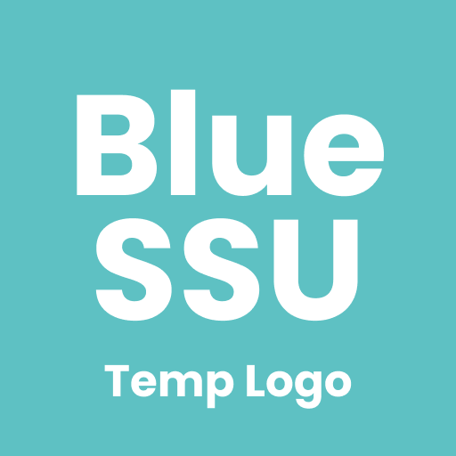

  

<h1 align="center">blue-ssu-api</h1>
<h5 align="center">숭실대학교 Open API 프로젝트</h5>

  
  

## overview
숭실대학교의 여러 서비스(유세인트, 급식 등)에서 얻을 수 있는 정보를 바탕으로 한 API에서 이용할 수 있도록 개발하는 프로젝트입니다.

직접 이 프로젝트를 실행하여, 자체 API 서버로 활용하거나, 또는 추후 개발 예정인 Blue SSU Open API Server을 통해 각 프로젝트에서 이용할 수 있도록 공개할 예정입니다.

## Endpoint

현재 지원하고자 하는 API는 아래와 같습니다. 각 API의 자세한 엔드포인트는 `/docs/endpoint/(엔드포인트)/README.md` 파일을 참고해주세요.

| API Code | 엔드포인트 | 설명 | 구현 여부 |
| - | - | - | - |
| cafeteria | /cafeterias | 학식 관련 API |  |
| oauth | /oauth | 숭실대 통합 로그인을 이용한 OAuth |  |
| library | /library | 도서관 관련 API |  |
| fun | /fun | 펀시스템 관련 API | |
| catch | /catch | SSU:catch 관련 API | |
| usaint | /usaint | 유세인트 관련 API | |
| pann | /pann | 숭실paNN 관련 API | |

## Contribute

Blue SSU API는 **오픈소스 프로젝트**로 누구나 기여하여 프로젝트를 발전시킬 수 있습니다. 이 프로젝트에 기여할 수 있는 주요 분야는 다음과 같습니다.

아래는 여러분이 기여할 수 있는 것에 대한 예시이며, 꼭 아래에 없더라도 프로젝트에 도움이 될 수 있다면 얼마든지 환영입니다!

개발 관련
* **기능 구현 (PR)**: 새로운 기능을 구현하고, PR을 보냄으로써 프로젝트에 기여할 수 있습니다. `Pull requests` 에서 할 수 있습니다.`
* **문서화 개선**: Blue SSU API의 기능 중 문서화가 부족한 부분에 대해 문서를 생성하거나 보완할 수 있습니다.
* **이슈 (Issue)**: 프로젝트의 새로은 기능을 제안하거나 버그를 제보할 수 있습니다. `Issues` 에서 할 수 있습니다.
* **코드 리뷰 (Code Review)**: PR 예정인 코드나, 현재 작성된 코드에 대한 리뷰를 할 수 있습니다.

개발 외적 관련
* **피드백 및 코멘트**: 프로젝트의 전체적인 사용성을 평가할 수 있습니다. 제 개인 메일(hyuns@hyuns.dev)이나 `discussions` 에서 할 수 있습니다.
* **홍보**: Blue SSU API를 많은 사람들이 알 수 있도록 홍보할 수 있습니다.

### 개발 관련 기여시
blue-ssu-api는 개발 스택으로 `Typescript`, `Nest.js`, `mariaDB` 를 사용합니다.
